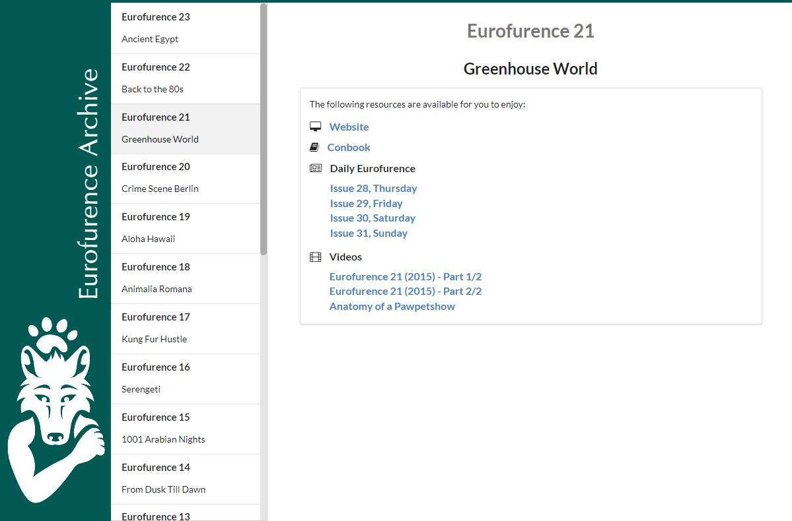

# Eurofurence Archive

This project contains the Eurofurence Archive page providing Conbooks, Websites, Daily Eurofurence issues and other resources of past conventions.

## Usage

To host this page, you need a static webserver serving the contents of the `build` directory.

To make changes to the page, you need node and npm. [Get it here.](https://nodejs.org/en/) Also make sure to run `npm install` before attempting to run `node build`.

To add or modify the content of the page, e.g. to add a new convention or fix a URL to any resource, check out the `pages` directory. After making the changes there, run `node build` to apply the changes. Afterwards, copy the files in the `build` directory to the server.

__Do not try to modify files in the build directory. They will be overwritten!__

## Development

If you want to add more features or fix bugs on the site itself, you need to follow these steps:

1. Make sure you have node and npm installed [Get it here.](https://nodejs.org/en/)
1. Clone this repository
1. Open a terminal in the root directory of this repository
1. run `npm install`
1. Make the necessary changes to the `template.html` or `build.js` files or by creating a new file in the `pages` directory.
1. After you are satisfied, run `node build`
1. Commit and Push your changes
